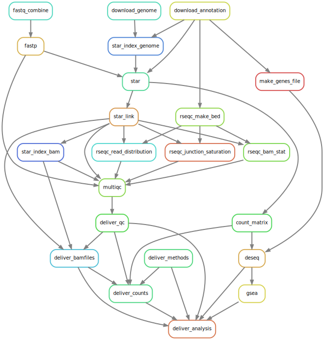

# RNA-Seq Workflow
<div align="center">
    
</div>

# Differential Expression using STAR / DESeq2
This workflow is designed to perform simple case-control analysis of one or more variables using DESeq.
The workflow leverages ties together the following pieces of software:
* [fastp](https://github.com/OpenGene/fastp)
* [STAR](https://github.com/alexdobin/STAR)
* [RSeQC](http://rseqc.sourceforge.net/)
* [MultiQC](https://multiqc.info/)
* [DESeq2](https://bioconductor.org/packages/release/bioc/html/DESeq2.html)

All software dependencies are automatically resolved using [conda](https://docs.conda.io/projects/conda/en/latest/user-guide/concepts/index.html).
Local execution and running via [SLURM](https://slurm.schedmd.com/) are supported.  
When running from an HPC all work should be done on an interactive session.

## Setup
### Code
From GitLab, fork this project filling out the project name, description, and ensure under namespace "SGT-Projects" is selected.  
Then, clone this repository into your project directory
```
git clone git@gitlab.oit.duke.edu:sgt-workflows/rnaseq-deseq2-star.git
```

Checkout new analysis branch and push this to your project repository
```
git checkout -b analysis
git push -u origin analysis
```

Change your default branch to `analysis` in GitLab via setting -> repository -> default branch.

### Conda
Install conda to `conda/` directory
```
wget https://repo.anaconda.com/miniconda/Miniconda3-latest-Linux-x86_64.sh
bash Miniconda3-latest-Linux-x86_64.sh -p conda -b
```

Activate the base environment and install mamba (a faster conda frontend)
```
source conda/bin/activate
conda install mamba -c conda-forge
```

Install Snakemake and activate environment
```
mamba env create -f snakemake.yaml
conda activate snakemake
```

To run the example data using SLURM, from the `.test/` directory, run
```
.././snakemake_slurm.sh -s ../workflow/Snakefile --use-conda -j500
```

## Running
Setup the correct genome and ensure the settings in `config/config.yaml` are correct, then prepare the workflow configuration files `fastqs.tsv`, `samples.tsv`, `analysis.yaml`.    
See documentation [here](config/README.md) for more information.  

It is often useful to see what Snakemake is planning on doing without running anything
```
snakemake -n
```

To run the workflow locally one could use
```
snakemake --use-conda -j<threads>
```
This will instruct Snakemake to resolve dependencies using conda and up to `<threads>` number of parallel tasks (or number of threads per-task).  
When running on SLURM use the helper script `snakemake_slurm.sh`.  
See Snakemake documentation for more [command line options](https://snakemake.readthedocs.io/en/stable/executing/cli.html#all-options).


Once an analysis is complete, ensure all your changes are commited and pushed to your project's repository.
